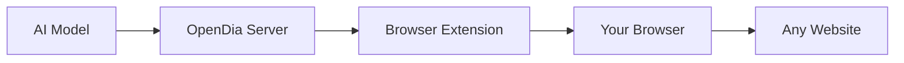

# OpenDia 

> **The open alternative to Dia**  
> Connect your browser to AI models. No browser switching needed—works seamlessly with any Chromium browser including Chrome & Arc.

[](https://badge.fury.io/js/opendia)
[](https://opensource.org/licenses/MIT)

## 📺 See it in Action


## 🚀 What is OpenDia?

OpenDia lets AI models control your browser automatically. **The key advantage? It leverages everything you already have**—your logged-in accounts, saved passwords, cookies, wallets, and browsing history. No need to start from scratch or switch contexts.

**🔑 Use Your Existing Digital Life:**
- ✅ **Logged-in accounts**: Post to Twitter / X, LinkedIn, Facebook with your existing sessions
- ✅ **Browser data**: Access your bookmarks, history, and saved passwords
- ✅ **Extensions & wallets**: Use MetaMask, password managers, or any installed extensions
- ✅ **Cookies & sessions**: Stay authenticated across all your favorite sites
- ✅ **Local testing**: Perfect for development with Cursor - test with real user sessions

**✨ Key Benefits:**
- 🔄 **Universal AI Support**: Works with Claude, ChatGPT, Cursor and even local models
- 🎯 **Anti-Detection**: Specialized bypasses for Twitter/X, LinkedIn, Facebook
- 📱 **Smart Automation**: AI understands your pages and finds the right elements
- 🛡️ **Privacy-First**: Everything runs locally, your data stays with you
- ⚡ **Zero Setup**: Get started with one command

## 🌐 Browser Support

Works with **any Chromium-based browser**:
- ✅ **Google Chrome**
- ✅ **Arc Browser** 
- ✅ **Microsoft Edge**
- ✅ **Brave Browser**
- ✅ **Opera**
- ✅ **Vivaldi**
- ✅ **Any Chromium variant**

Perfect for **Cursor users** who want to automate their local testing and development workflows!

## 🎬 What You Can Do

**Real workflows you can try today:**

### 📰 Content & Social Media
- **"Summarize all the articles I read today and post a Twitter thread about the key insights"**
- **"Find interesting articles related to AI from my bookmarks and create a reading list"**
- **"Read this article and post a thoughtful comment on the LinkedIn version"**
- **"Check my recent Twitter bookmarks and summarize the main themes"**

### 📧 Productivity & Research
- **"Browse my latest emails and tell me what needs urgent attention"**
- **"Find all the GitHub repos I visited this week and create a summary report"**
- **"Extract the main points from this research paper and save them to my notes"**
- **"Search my browsing history for that article about AI safety I read last month"**

### 🤖 Development & Testing (Perfect for Cursor!)
- **"Test my web app's signup flow and take screenshots at each step"**
- **"Fill out this form with test data and check if validation works"**
- **"Navigate through my app and check if all the buttons work properly"**
- **"Use my connected wallet to test this DeFi interface"**

### 🔄 Advanced Automation
- **"Open tabs for all my daily news sources and summarize the top stories"**
- **"Draft replies to my unread messages based on the context"**
- **"Monitor this webpage and notify me when the content changes"**
- **"Automatically bookmark interesting articles I'm reading"**

## ⚡ Quick Start

### 1. Start the Server
```bash
npx opendia
```

### 2. Install the Browser Extension
1. Download from [releases](https://github.com/aaronjmars/opendia/releases)
2. Go to `chrome://extensions/` (or your browser's extension page)
3. Enable "Developer mode"
4. Click "Load unpacked" and select the extension folder

### 3. Connect to Your AI
**For Claude Desktop**, add to your configuration:
```json
{
  "mcpServers": {
    "opendia": {
      "command": "npx",
      "args": ["opendia"]
    }
  }
}
```

**For Cursor or other AI tools**, use the same configuration or follow their specific setup instructions.

## 🛠️ Capabilities

OpenDia gives AI models **17 powerful browser tools**:

### 🎯 Smart Page Understanding
- **Analyze any webpage** - AI automatically finds buttons, forms, and interactive elements
- **Extract content intelligently** - Get clean text from articles, social posts, or search results
- **Understand context** - AI knows what type of page it's looking at and how to interact with it

### 🖱️ Natural Interactions  
- **Click anything** - Buttons, links, menus - AI finds and clicks the right elements
- **Fill forms smartly** - Works even on complex sites like Twitter, LinkedIn, Facebook
- **Navigate seamlessly** - Go to pages, scroll, wait for content to load
- **Handle modern web apps** - Bypasses detection on social platforms

### 📑 Tab & Window Management
- **Multi-tab workflows** - Open, close, switch between tabs automatically
- **Organize your workspace** - Let AI manage your browser tabs efficiently
- **Coordinate complex tasks** - Work across multiple sites simultaneously

### 📊 Access Your Browser Data
- **Bookmarks & History** - Find that article you read last week
- **Current page content** - Get selected text, links, or full page content
- **Real-time information** - Work with whatever's currently on your screen

### 🛡️ Anti-Detection Features
- **Social media posting** - Bypass automation detection on Twitter/X, LinkedIn, Facebook
- **Natural interactions** - Mimics human behavior to avoid triggering security measures
- **Reliable automation** - Works consistently even on sites that block typical automation tools

## 💬 Example Prompts to Try

Once everything is set up, try asking your AI:

**Content Creation:**
> *"Read the article on this page and create a Twitter thread summarizing the main points"*

**Research & Analysis:**
> *"Look through my browser history from this week and find articles about machine learning. Summarize the key trends."*

**Social Media Management:**
> *"Check my Twitter bookmarks and organize them into categories. Create a summary of each category."*

**Productivity:**
> *"Open tabs for my usual morning reading sites and give me a briefing of today's top stories"*

**Development Testing:**
> *"Fill out this contact form with test data and check if the submission works properly"*

**Personal Assistant:**
> *"Find that GitHub repo I was looking at yesterday about React components and bookmark it for later"*

## 🏗️ How It Works



1. **You ask** your AI to do something browser-related
2. **AI calls** OpenDia tools to understand and interact with pages
3. **OpenDia controls** your browser through the extension
4. **You get results** - AI can see what happened and respond intelligently

## 🔒 Security & Privacy

**Your data stays private**:
- ✅ **Everything runs locally** - No cloud processing of your browsing data
- ✅ **You control access** - Extension only works when you want it to
- ✅ **Open source** - Full transparency of what the code does
- ✅ **No tracking** - We don't collect or store any of your information

**Important**: This tool requires broad browser permissions to function. Only use with AI models you trust, and in environments where you're comfortable with browser automation.

## 🤝 Contributing

Love to have your help making OpenDia better!

### Quick Development Setup
```bash
git clone https://github.com/aaronjmars/opendia.git
cd opendia

# Start the server
cd opendia-mcp
npm install
npm start

# Load extension in your browser
# Go to chrome://extensions/ → Developer mode → Load unpacked: ./opendia-extension
```

### Ways to Contribute
- 🐛 **Report bugs** via [GitHub Issues](https://github.com/aaronjmars/opendia/issues)
- 💡 **Share it on social medias**
- 🔧 **Add new browser capabilities** 
- 📖 **Improve documentation**
- 🧪 **Test with different AI models**

## 📝 License

MIT License - see [LICENSE](LICENSE) for details.

---

**Ready to supercharge your browser with AI? Get started with `npx opendia`! 🚀**
